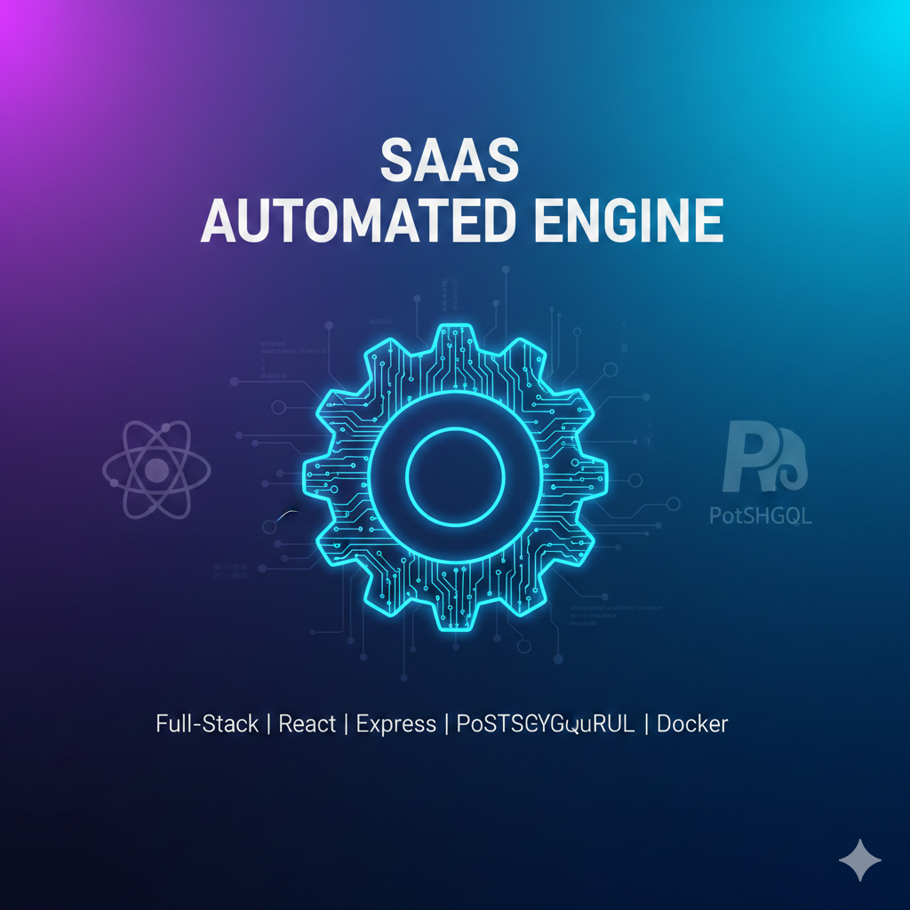

# SaaS Automated Engine

This repository contains a full-stack SaaS application built with a React frontend and an Express backend, utilizing PostgreSQL for data storage.

## Project Structure

The project is organized into two main components:

* **Backend**: An Express.js server using TypeScript, handling authentication and database operations.
* **Frontend**: A React application built with Vite and TypeScript, featuring a dashboard and login interface.

## Features

* **User Authentication**: JWT-based secure login and registration.
* **Database Integration**: Managed through a PostgreSQL connection pool.
* **Containerized Deployment**: Infrastructure defined via Docker Compose for easy setup of application and database services.

## Tech Stack

### Frontend

* **React** (TypeScript)
* **Vite** (Build tool)
* **React Hot Toast** (Notifications)
* **Axios** (API requests)

### Backend

* **Node.js & Express**
* **TypeScript**
* **PostgreSQL** (via `pg` library)
* **Bcrypt.js** (Password hashing)
* **JSON Web Token** (Authentication)

## Getting Started

### Prerequisites

* Node.js (LTS version recommended)
* Docker and Docker Compose

### Setup

1. **Environment Configuration**:
Create a `.env` file in the root directory based on the requirements for database connectivity and JWT secrets.
2. **Database Initialisation**:
The project includes initialization scripts located in `init-scripts/01-init.sql` to set up the required table structures.
3. **Run with Docker**:
You can start the entire stack using Docker Compose:
```bash
docker-compose up --build

```


4. **Local Development**:
* **Backend**: Navigate to `backend/`, run `npm install`, then `npm run dev`.
* **Frontend**: Navigate to `frontend/`, run `npm install`, then `npm run dev`.